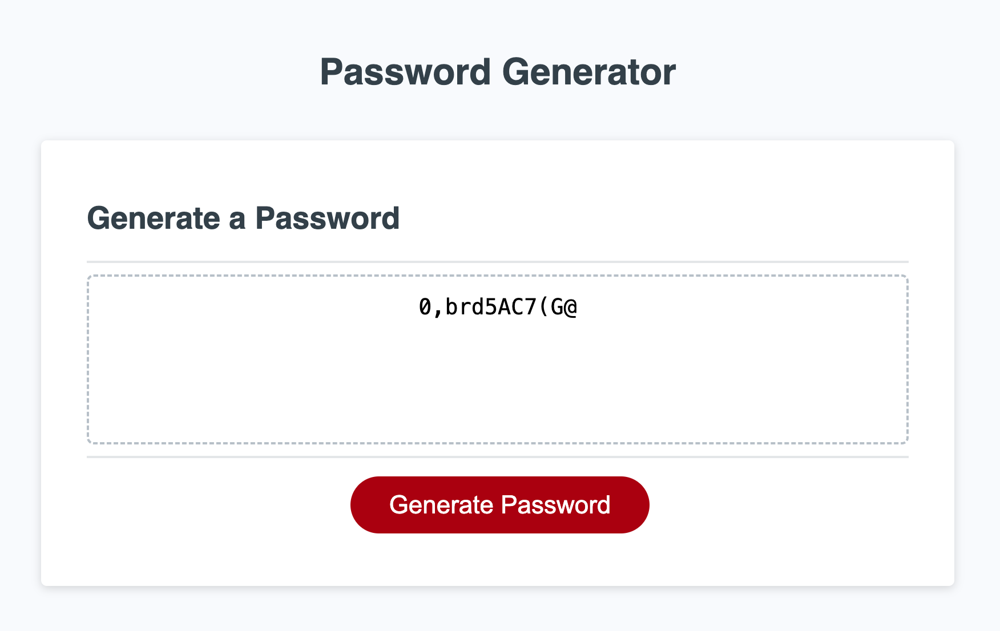

# Secure Password Generator
This website can help you with generating secure passwords. Once clicked on the '**Generate Password**' button, it will ask for prompts to gather information about password from the user.

- **Visit** the deployed webapp at : https://gsgghotra.github.io/secure_password_generator/

## Table of Contents

1. [Introduction](#introduction)
2. [Screenshots](#screenshots)

## Introduction
    
**Purpose:** Generate a random password based on criteria user selects.

Present a series of prompts for password criteria:

- At least 8 characters but no more than 128.

- Character types (Lowercase Uppercase Numeric Special characters ($@%&*, etc)).

- Code should validate for each input and at least one character type should be selected.

- Once prompts are answered then the password should be generated and displayed in an alert or written to the page.

## Screenshots
- **Index Page**:

- **Length of password Prompt**:

- **Successful password**: 12 characters with all 4 character options.

- **Cancelled Prompt**: When cancelled the prompts.

- **Console Results**: No errors after password successfully generated.

